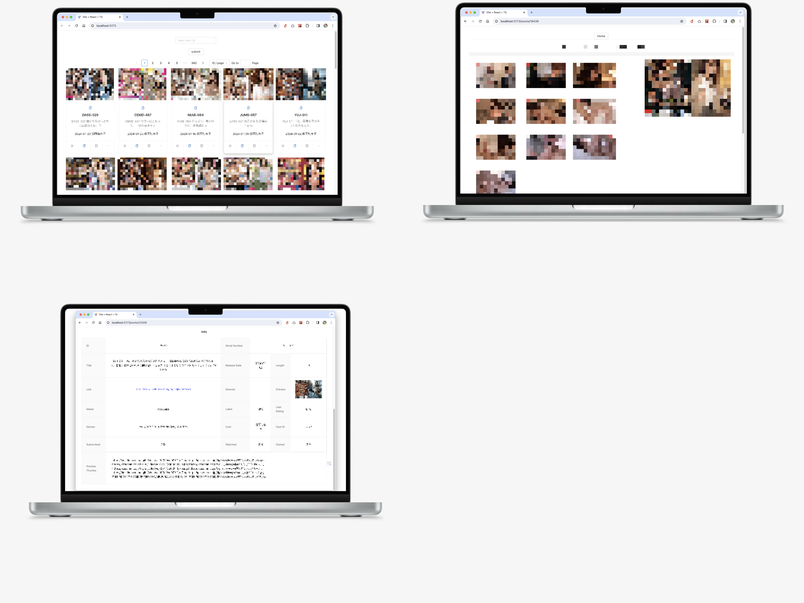

# :hugs:New Version Coming!:hugs:

A tool to scrape works data from library and displaying in custom website.

this project includes backend and frontend.



The previous version of JavlibraryScrapy is released to the following address:
<https://github.com/desonglll/JavlibraryScrapy/releases>

- [:hugs:New Version Coming!:hugs:](#hugsnew-version-cominghugs)
  - [Repoistories](#repoistories)
  - [:zzz: Requirements](#zzz-requirements)
    - [Before](#before)
    - [:snake: Install Conda](#snake-install-conda)
    - [Create a new Python environment using conda](#create-a-new-python-environment-using-conda)
    - [Clone](#clone)
    - [Install `poetry`](#install-poetry)
  - [:rocket: Running](#rocket-running)
    - [Configuration](#configuration)
    - [Initialize Database](#initialize-database)
    - [Start scrapy](#start-scrapy)
    - [Delete database](#delete-database)
  - [Backend Server](#backend-server)
  - [Frontend Server](#frontend-server)

## Repoistories

**Github**

<https://github.com/desonglll/JavlibraryScrapy>

**Gitee**

<https://gitee.com/desonglll/scrapy-jav>

## :zzz: Requirements

### Before

`Windows/macOS/Linux`

`git`

`mysql8`

And proxy to access `Javlibrary`.

### :snake: Install Conda

[Quick command line install](https://docs.anaconda.com/free/miniconda/)

These quick command line instructions will get you set up quickly with the latest Miniconda installer. For graphical
installer (.exe and .pkg) and hash checking instructions, see Installing Miniconda.

**For macOS**

These four commands quickly and quietly install the latest M1 macOS version of the installer and then clean up after
themselves. To install a different version or architecture of Miniconda for macOS, change the name of the .sh installer
in the curl command.

```shell
mkdir -p ~/miniconda3
curl https://repo.anaconda.com/miniconda/Miniconda3-latest-MacOSX-arm64.sh -o ~/miniconda3/miniconda.sh
bash ~/miniconda3/miniconda.sh -b -u -p ~/miniconda3
rm -rf ~/miniconda3/miniconda.sh
```

After installing, initialize your newly-installed Miniconda. The following commands initialize for bash and zsh shells:

```shell
~/miniconda3/bin/conda init bash
~/miniconda3/bin/conda init zsh
```

### Create a new Python environment using conda

```shell
conda create -n scrapyJAV python=3.11
```

Then activate environment

```shell
conda activate scrapyJAV
```

### Clone

**Github**

```shell
git clone https://github.com/desonglll/JavlibraryScrapy.git scrapyjav-project
```

**Gitee**

```shell
git clone https://gitee.com/desonglll/scrapy-jav.git scrapyjav-project
```

### Install `poetry`

If you are in `scrapyjav-project` directory:

```shell
pip install poetry
cd scrapyJAV
poetry install
```

## :rocket: Running

### Configuration

Edit `scrapyJAV/config.yaml` for database configuration.

Edit `scrapyJAV/config.yaml` for argument configuration.

:pencil: Edit configuration arguments based on your needs.

- Enter the actor ID that you want to scrape.
- Eg: `https://www.javlibrary.com/cn/vl_star.php?list&mode=&s=ae5q6&page=1` and `ae5q6`is the id of 楓カレン
- In `id_references`, there are some references of actress ID in json format.

### Initialize Database

Suppose you are in `scrapyjav-project` directory.

Running the following command for initialize the database.

```shell
poetry run scrapyjav -d init
```

### Start scrapy

Suppose you are in `scrapyjav-project.scrapyJAV` directory.

Running the following command:

```shell
poetry run scrapyjav -c start
```

### Delete database

```shell
poetry run scrapyjav -d delete
```

## Backend Server

Go into the `backend` folder, and see [`README.md`](./backend/README.md) there.

## Frontend Server

Go into the `frontend` folder, and see [`README.md`](./frontend/README.md) there.

## Star History

[](https://star-history.com/#desonglll/JavlibraryScrapy&Date)
